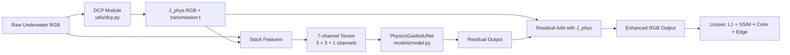

# Physics-Guided Underwater Image Enhancement

This project trains a physics-guided deep model for underwater image enhancement.
The pipeline combines:
- a physics prior from Dark Channel Prior (DCP), and
- a residual U-Net style network (`PhysicsGuidedUNet`) that refines the physics output.

## Repository Structure

- `train.py` - end-to-end training + in-loop evaluation (PSNR, SSIM, UIQM), best model saving.
- `test.py` - simple standalone DCP restoration smoke test on one image.
- `models/model.py` - model definition (`PhysicsGuidedUNet` + `ResidualBlock`).
- `utils/dataset.py` - dataset loader that builds 7-channel input `[raw RGB + J_phys RGB + transmission t]`.
- `utils/dcp.py` - Dark Channel Prior utilities.
- `best_model.pth`, `physics_guided_model.pth` - model checkpoints.
- `metrics.md` - sample training logs/metrics.

## Requirements

Python 3.9+ recommended.

Install dependencies:

```bash
python -m venv .venv
source .venv/bin/activate
pip install --upgrade pip
pip install torch torchvision opencv-python numpy scikit-image pytorch-msssim
```

Notes:
- On Apple Silicon, `train.py` automatically uses `mps` when available.
- If `mps` is unavailable, training falls back to CPU.

## Dataset Layout

`train.py` expects paired images with the same filenames:

```text
data/
  raw/
    img1.jpg
    img2.jpg
    ...
  reference/
    img1.jpg
    img2.jpg
    ...
```

Each image in `data/raw` must have a matching target image in `data/reference`.

## How To Run

### Train

```bash
python train.py
```

What this does:
- Loads dataset from `data/raw` and `data/reference`.
- Builds 7-channel input in `utils/dataset.py`.
- Trains for 30 epochs (batch size 2).
- Saves preview images into `outputs/` every epoch (first batch).
- Saves best checkpoint as `best_model.pth` based on PSNR.

### Quick Test (DCP baseline)

`test.py` runs only the physics DCP restoration (not the neural model):

```bash
python test.py
```

By default it expects `test.jpeg` in the project root and writes `output.jpg`.

## How To Evaluate / Validate

There is no separate evaluation script yet; evaluation currently runs inside `train.py` each epoch:
- **PSNR** and **SSIM**: computed against `data/reference`.
- **UIQM**: no-reference underwater quality indicator.

If you want a clean train/val split or standalone model inference path, adding a dedicated `eval.py`/`infer.py` script is the next step.

## Sample Metrics

From your final-pass run:

- **PSNR:** around `20.6`
- **SSIM:** around `0.89`
- **UIQM:** `1300+`

These values are dataset- and preprocessing-dependent, so some variation across runs/hardware is expected.

## Simple Architecture Diagram



## Current Limitations

- `infer.py` is currently empty.
- `config.py` is currently empty.
- `test.py` validates only DCP, not learned checkpoint inference.

## Repro Tips

- Keep paired filenames strictly aligned between `raw` and `reference`.
- Start with small image subsets to verify data loading.
- Monitor `outputs/` previews to catch color or alignment issues early.